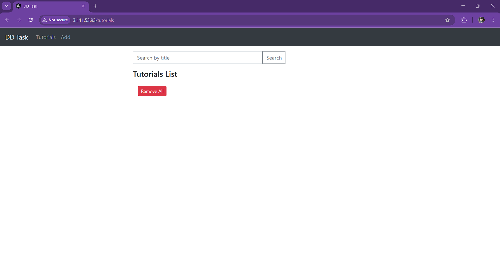

# MEAN Stack CRUD Application

A full-stack CRUD application built with MongoDB, Express, Angular, and Node.js — containerized with Docker and deployed on an Ubuntu VM with a CI/CD pipeline using GitHub Actions.

---

## 📁 Project Structure

```
mean-crud-app/
│
├── .github/
│   └── workflows/
│       └── deploy.yml          # CI/CD GitHub Actions pipeline
│
├── backend/
│   ├── crud-dockerfile         # Dockerfile for backend
│   └── (Node.js/Express files)
│
├── frontend/
│   ├── crud-dockerfile         # Dockerfile for frontend
│   ├── nginx.conf              # Nginx config for Angular app
│   └── (Angular files)
│
├── docker-compose.yml          # Docker Compose configuration
├── nginx-proxy.conf            # Nginx reverse proxy config
└── README.md
```

---

## 🛠️ Prerequisites

Make sure you have the following installed:

- [Docker Desktop](https://www.docker.com/products/docker-desktop/)
- [Node.js](https://nodejs.org/) (v18+)
- [Git](https://git-scm.com/)
- [Angular CLI](https://angular.io/cli)
- A [Docker Hub](https://hub.docker.com/) account
- A cloud VM (AWS EC2 / Azure) running Ubuntu 22.04

---

## 🚀 Local Setup Instructions

### Step 1: Clone the Repository
```bash
git clone https://github.com/CJSBLACKPEARL/mean-crud-app.git
cd mean-crud-app
```

### Step 2: Run with Docker Compose
```bash
docker-compose up -d
```

### Step 3: Access the Application
Open your browser and go to:
```
http://localhost
```

---

## 🐳 Docker Setup

### Build Backend Image
```bash
docker build -f ./backend/crud-dockerfile -t omjangs1774/mean-backend:latest ./backend
```

### Build Frontend Image
```bash
docker build -f ./frontend/crud-dockerfile -t omjangs1774/mean-frontend:latest ./frontend
```

### Push Images to Docker Hub
```bash
docker login
docker push omjangs1774/mean-backend:latest
docker push omjangs1774/mean-frontend:latest
```

---

## ☁️ VM Deployment Instructions

### Step 1: Launch Ubuntu VM
- Create an Ubuntu 22.04 VM on AWS EC2 or Azure
- Open ports **22** (SSH) and **80** (HTTP) in security group

### Step 2: Install Docker on VM
```bash
sudo apt update
sudo apt install -y docker.io docker-compose
sudo usermod -aG docker ubuntu
newgrp docker
```

### Step 3: Clone Repository on VM
```bash
git clone https://github.com/CJSBLACKPEARL/mean-crud-app.git
cd mean-crud-app
```

### Step 4: Start the Application
```bash
docker-compose up -d
```

### Step 5: Verify Containers are Running
```bash
docker ps
```

You should see 4 containers running: `mongo`, `backend`, `frontend`, `nginx`

### Step 6: Access the Application
Open your browser and go to:
```
http://YOUR_VM_PUBLIC_IP
```

---

## 🔄 CI/CD Pipeline (GitHub Actions)

The CI/CD pipeline is configured in `.github/workflows/deploy.yml` and triggers automatically on every push to the `main` branch.

### Pipeline Steps:
1. Checkout code from GitHub
2. Login to Docker Hub
3. Build and push backend Docker image
4. Build and push frontend Docker image
5. SSH into VM and pull latest images
6. Restart containers with updated images

### GitHub Secrets Required:

Go to `GitHub Repo → Settings → Secrets → Actions` and add:


`DOCKER_USERNAME` = Your Docker Hub username 
`DOCKER_PASSWORD` = Your Docker Hub password
`VM_HOST` = Your VM public IP address 
`VM_SSH_KEY` = Contents of your `.pem` private key

---

## 🌐 Nginx Reverse Proxy

Nginx is used as a reverse proxy to route traffic on port 80.

- `/` → routes to Angular frontend
- `/api` → routes to Node.js backend (port 3000)

The `nginx-proxy.conf` file handles all routing at the VM level.

---

## 📸 Screenshots

### CI/CD Pipeline - GitHub Actions


### Docker Hub - Images Pushed


### Application Running in Browser


### Docker Containers Running on VM


### AWS EC2 as VM


## 🗄️ Database

MongoDB is used as the database, running as a Docker container via the official `mongo:6` image.

- **Connection String:** `mongodb://mongo:27017/meandb`
- **Data Persistence:** MongoDB data is stored in a Docker volume `mongo_data`

---


## ⚠️ Important Note

The cloud infrastructure is kept running for live demonstration purposes. The server may be stopped but can be restarted when needed for review.

---

## 👤 Author

**CJSBLACKPEARL**  
GitHub: [https://github.com/CJSBLACKPEARL](https://github.com/CJSBLACKPEARL)
